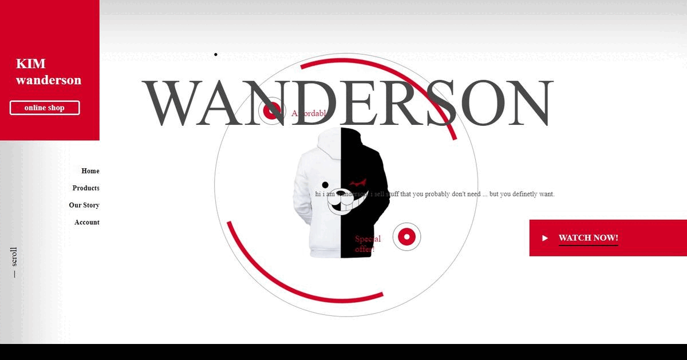

# Ecommerce-website
Frontend ecommerce website to display items for sale

this website is made using forntend frameworks and libraries only!

<<<<<<< HEAD
## 🎨 Layout

### Ajustes e melhorias

O Projeto foi desenvolvido com as Tecnologia e voltadas nas seguintes Tarefas:

- [x] Criação do HTML
- [x] Criação do CSS
- [x] Criação do JAVASCRIPT
=======
>>>>>>> 0d4690aafa6c4984bb0f32e9b7e9195ad32dfcf8

 🧑‍💻 Technologies e Tools I use:
 
 

 
 
 

<<<<<<< HEAD
  

### 🚀 Colaboradores

Agradecemos às seguintes pessoas que contribuíram para este projeto:

<table>
  <tr>
     <td align="center">
      <a href="#">
         
        
          <b>wanderson de farias</b>
        
        
      </a>
    </td>
    <a href="https://github.com/wandersondefariasprogramador" >LINK-GITHUB</a>

  </tr>
 
</table>
 
 check application <a href="https://wandersondefariasprogramador.github.io/Site-de-Relogios-15.12.22/
 ">HERE!</a>

=======
>>>>>>> 0d4690aafa6c4984bb0f32e9b7e9195ad32dfcf8
